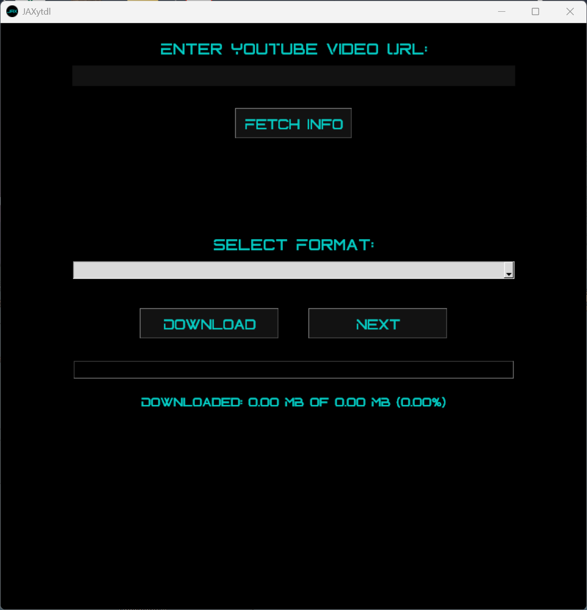
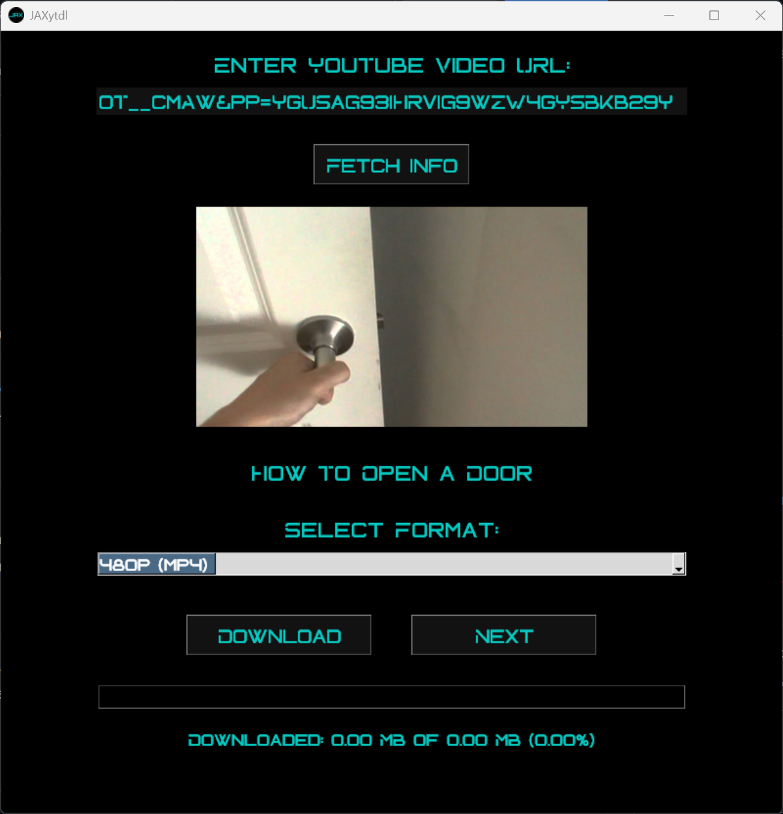

# JaxYTdl - YouTube Downloader

JaxYTdl is a lightweight and user-friendly YouTube video downloader built with Flask. It allows you to download YouTube videos in various resolutions or extract audio in MP3 format.

## Features
- Download videos in multiple resolutions (144p to 2160p).
- Extract and download audio in high-quality MP3 format.
- Simple and intuitive user interface.
- Fast and reliable performance.

## Screenshots

### Home Page


### Format Selection


## How to Use
1. Enter the YouTube video URL into the input field.
2. Click "Get Formats" to fetch available download options.
3. Select the desired format (video or audio).
4. Click "Download" to start the download process.

## Installation

To run JaxYTdl on your local machine, follow these steps:

### Clone the repository:
```bash
git clone https://github.com/Jalpan04/JaxYTdl.git
cd JaxYTdl
```

### Install dependencies:
Make sure you have Python installed. Then, install the required packages:
```bash
pip install -r requirements.txt
```

### Run the application:
```bash
python app.py
```

### Open in your browser:
After starting the application, open your browser and visit:
```
http://127.0.0.1:5000/
```
Now, you can start downloading videos and audio files.

## Dependencies
- **Flask**: Web framework for Python.
- **yt-dlp**: A powerful tool to download YouTube videos.
- **FFmpeg**: Required for handling video and audio formats.

## Contributing
Feel free to contribute by submitting issues or pull requests to improve JaxYTdl.

## License
This project is open-source and available under the MIT License.

---

Enjoy seamless YouTube downloads with JaxYTdl! 🚀

